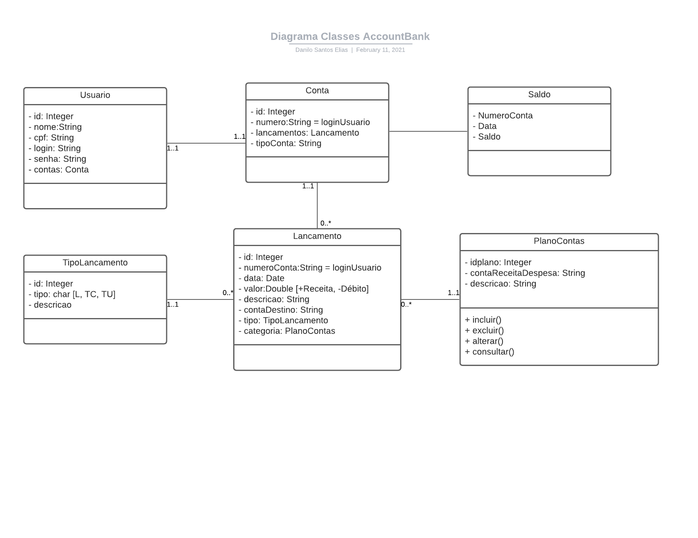

# Projeto Account Java API

## Time Multiplayer
- [Danilo Elias](https://github.com/danilose)
Ajudou no desenvolvimento da modelagem e implementação dos Services e Models.
- [Lucas Villarim](https://github.com/LucasVillarim)
Ajudou no desenvolvimento da modelagem e implementação dos Services e Models.
- [Luciano Faria](https://github.com/lucianofa)
Ajudou no desenvolvimento da modelagem e entendimento dos requisitos.
- [Mathias Ribeiro](https://github.com/ribeiromathias)
Ajudou no desenvolvimento da modelagem e está focado no desenvolvimento da parte web em HTML, CSS e JavaScript

## Modelagem inicial


## Estrutura do Projeto
Dividimos as classes em pacotes de acordo com suas responsabilidades.
- Model: onde definimos os modelos ou seja as classes dos objetos que usamos no sistema
- Service: onde definimos as regras de negócio para manipulação dos Models
- Enums: onde definimos nossos Enums
- Exception: onde definimos nossas Exeptions

```
📦src
 ┗ 📂main
   ┗ 📂java
     ┗ 📂com.multiplayer.projetoaccountjpa
       ┣ 📂enums
       ┃ ┣ 📜TipoConta.java
       ┃ ┣ 📜TipoLancamento.java
       ┃ ┗ 📜TipoPlanoConta.java
       ┣ 📂exception
       ┃ ┣ 📜LoginJaCadastradoException.java
       ┃ ┗ 📜SaldoInsuficienteException.java
       ┣ 📂model
       ┃ ┣ 📜Conta.java
       ┃ ┣ 📜Lancamento.java
       ┃ ┣ 📜PlanoConta.java
       ┃ ┗ 📜Usuario.java
       ┗ 📂service
         ┣ 📜LancamentoService.java
         ┣ 📜LoginService.java
         ┣ 📜PlanoContaService.java
         ┗ 📜UsuarioService.java
```

## Usuário
O model tem os atributos:
- Nome
- CPF
- Login
- Senha
- Conta

Tem os getters e setter dos atributos.

Também tem um construtor que já cria a Conta com o login como número dela.

O service faz as validações para criação do usuário.
- O nome, cpf, login e senha não podem ser nulos.
- O login não pode passar de 20 caracteres.
- O cpf não pode passar de 11 caracteres.
- Não pode cadastrar um usuário com um login já existente no sistema.

## Conta
O model tem os atributos:
- Número (é igual ao login do usuário)
- Tipo ([TipoConta Enum](#tipoconta-enum))
- Saldo
- Lançamentos

Tem os getters e setter dos atributos.

Também tem um construtor que inicia o tipo com o [TipoConta.CORRENTE](#tipoconta-enum) e o saldo 0.

No momento não tem um service pois a criação da conta somente se dá na criação de um usuário.

## Lançamento
O model tem os atributos:
- Número da conta do usuário
- Data
- Valor
- Tipo ([TipoLancamento Enum](#tipolancamento-enum))
- Descrição
- Número da conta de destino (para o caso de transferência)

Tem os getters e setter dos atributos.

O service faz as validações para criação do lançamento.
- O número da conta, valor, descricao, tipo e plano de conta (categoria) não podem ser nulos.
- O valor não pode ser negativo.
- Se for transferência a conta de destino não pode ser nula.
- O número da conta do usuário e de destino devem ser de contas já cadastradas no sistema.
- Caso seja um débito ou uma transferência o valor não deve deixar o saldo negativo.

Também faz a colsulta do extrato por duas datas passadas. Onde a data de fim deve ser posterior da data de inicio e não podem ser nulas.

## Plano Conta (Categoria)
O model tem os atributos:
- Tipo ([TipoPlanoConta Enum](#tipoplanoconta-enum))
- Descrição

Tem os getters e setter dos atributos.

O service faz as validações para criação do plano conta.
- A descricao e o tipo não podem ser nulos.

## Login
O service faz a validação do login do usuário no sistema.
- O login e a senha não podem ser nulos.
- Busca o usuário pelo login e compara a senha passada com a cadastrada.

## TipoConta Enum
- CORRENTE
- CREDITO
- POUPANCA

## TipoPlanoConta Enum
- RECEITA
- DESPESA

## TipoLancamento Enum
- DEBITO
- CREDITO
- TRANSFERENCIA


# SPRING BOOT
- A API será um Bankline com funcionalidades específicas, hospedada no Swagger 
para apresentação do projeto final e posteriores checagens realizadas por terceiros.

## Funcionalidades da API
### Usuário
- Criar
- Logar
- Listar

## Banco
### Transações bancárias
- Pagamento
- Depósito
- Transferência
- Listagem de transações

#Implementações de segurança
A api faz uso de Jason Web Token (JWT) para autenticação de endpoints durante o uso 
da mesma além do Spring Security para configurações internas de BackEnd.

# Como funciona?

Ao criar o usuário, o sistema de login fica disponível, habilitando o acesso pelo 
endpoint 


Após o login o endpoint retornará uma resposta contendo os dados de autenticação, 
contendo um token bearer que será filtrado pela implemetação do JWT no Java, o que 
permitirá o acesso as demais funcionalidades.

## Utilizando as transações

Para realizar uma transação, a requisição deverá ser feita no endpoint "/lancamentos".

Para se alternar entre os diferentes tipos de transações foi implementado um 
sistema de Enum em que fica disponível para o usuário as opções de: Débito, Crédito 
e Transferência. Para alternar, o usuário deve mudar o valor do campo "tipo". Dependendo 
da opção, a conta destino terá o saldo alterado.

## Demonstração de uma transação

Listamos os usuários para ver as possíveis conexões durante uma transação. 
Nota-se que o JWT já está sendo requisitado. 


requisitamos o endpoint de "/contas" para checar o saldo inicial.


Preparamos o corpo da requisição e enviamos a transação colocando o id da conta que 
desejamos creditar, o campo contaDestino só tera relevância caso a transação seja "Transferência", 
neste caso deixaremos vazio.


Tendo sucesso no envio, requisitamos o endpoint referente as contas de um usuário 
para checagem do saldo novamente.


Por fim percebe-se que a conta foi creditada e todas as operações foram realizadas 
apenas por causa da autenticação do JWT.