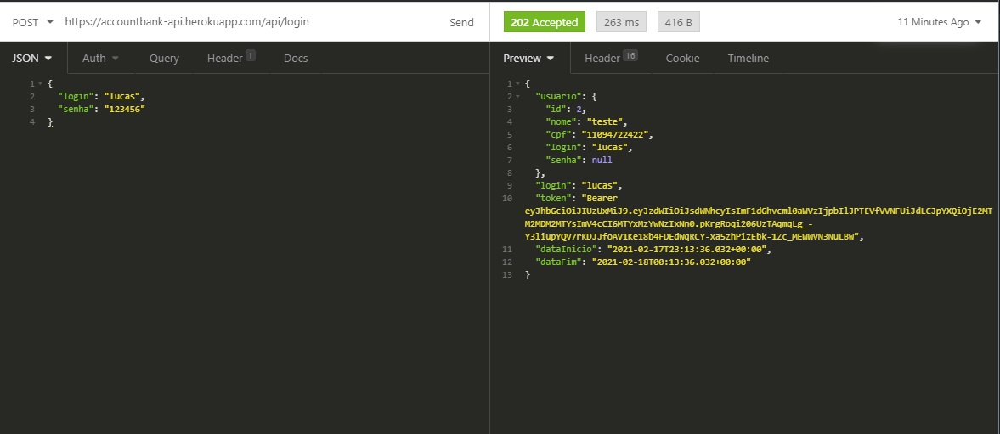
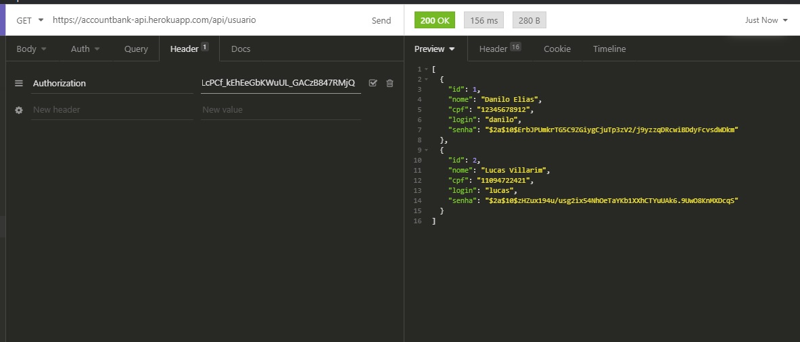
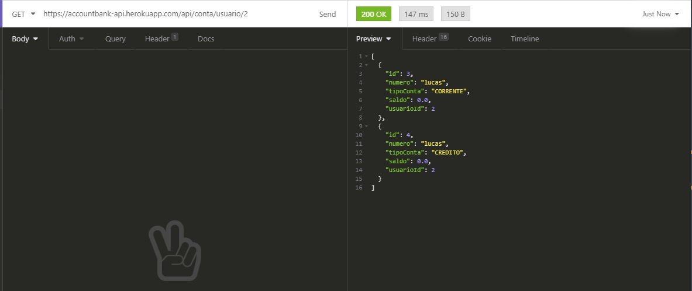
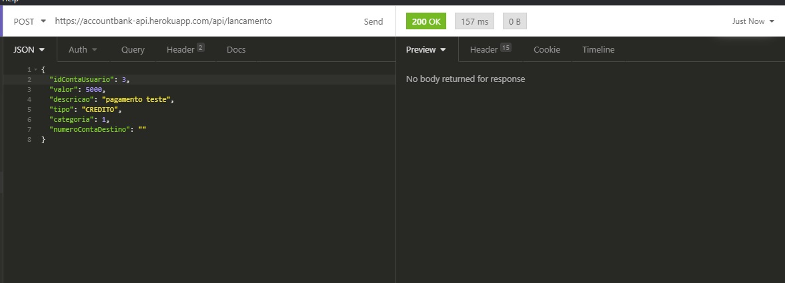
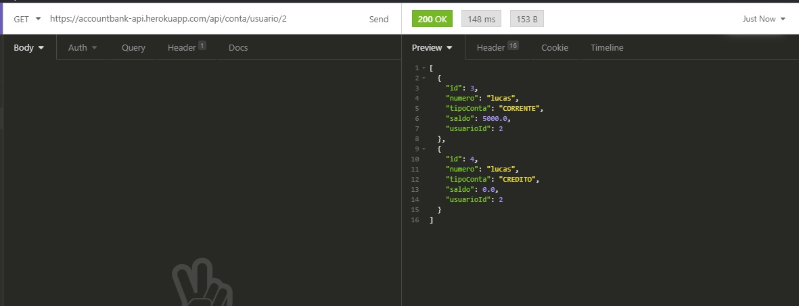

# Projeto Account Java API

API de um Bankline com cadastro de usuário, contas e lançamentos.
A documentação da API pode ser acessada em [accountbank-api.herokuapp.com/swagger-ui.html](https://accountbank-api.herokuapp.com/swagger-ui.html)

## Time Multiplayer
- [Danilo Elias](https://github.com/danilose)
Ajudou no desenvolvimento da modelagem e implementação dos Services, Models, Endpoints e configurações de segurança.
- [Lucas Villarim](https://github.com/LucasVillarim)
Ajudou no desenvolvimento da modelagem e implementação dos Services, Models, Endpoints e configurações de segurança.

## Estrutura do Projeto
Dividimos as classes em pacotes de acordo com suas responsabilidades.
- Model: onde definimos os modelos ou seja as classes dos objetos que usamos no sistema
- Repository: onde definimos o JPA para acessar os dados do BD
- Service: onde definimos as regras de negócio para manipulação dos Models
- Dto: onde definimos as classes em que serão consumidas e enviadas pelo frontend
- Controller: também chamado de Resource foi onde definimos a interação do frontend com a API por meio da definição dos endpoints
- Enums: onde definimos nossas enumerações
- Exception: onde definimos nossas exceções
- Doc: onde definimos as configurações do Swagger para documentar a API
- Configuration: onde definimos as configurações de segurança do Spring Security e JWT

```
📦src
 ┣ 📂main
 ┃ ┣ 📂java
 ┃ ┃ ┗ 📂br
 ┃ ┃ ┃ ┗ 📂multiplayer
 ┃ ┃ ┃ ┃ ┗ 📂accountapi
 ┃ ┃ ┃ ┃ ┃ ┣ 📂configuration
 ┃ ┃ ┃ ┃ ┃ ┃ ┣ 📜JWTAuthorizationFilter.java
 ┃ ┃ ┃ ┃ ┃ ┃ ┣ 📜JWTConstants.java
 ┃ ┃ ┃ ┃ ┃ ┃ ┗ 📜SecurityConfig.java
 ┃ ┃ ┃ ┃ ┃ ┣ 📂controller
 ┃ ┃ ┃ ┃ ┃ ┃ ┣ 📜ContaController.java
 ┃ ┃ ┃ ┃ ┃ ┃ ┣ 📜DashboardController.java
 ┃ ┃ ┃ ┃ ┃ ┃ ┣ 📜LancamentoController.java
 ┃ ┃ ┃ ┃ ┃ ┃ ┣ 📜LoginController.java
 ┃ ┃ ┃ ┃ ┃ ┃ ┣ 📜PlanoContaController.java
 ┃ ┃ ┃ ┃ ┃ ┃ ┗ 📜UsuarioController.java
 ┃ ┃ ┃ ┃ ┃ ┣ 📂doc
 ┃ ┃ ┃ ┃ ┃ ┃ ┗ 📜SwaggerConfig.java
 ┃ ┃ ┃ ┃ ┃ ┣ 📂dto
 ┃ ┃ ┃ ┃ ┃ ┃ ┣ 📜ContaDto.java
 ┃ ┃ ┃ ┃ ┃ ┃ ┣ 📜DashboardDto.java
 ┃ ┃ ┃ ┃ ┃ ┃ ┣ 📜ExtratoDto.java
 ┃ ┃ ┃ ┃ ┃ ┃ ┣ 📜ExtratoRequestDto.java
 ┃ ┃ ┃ ┃ ┃ ┃ ┣ 📜LancamentoDto.java
 ┃ ┃ ┃ ┃ ┃ ┃ ┣ 📜LoginDto.java
 ┃ ┃ ┃ ┃ ┃ ┃ ┣ 📜PlanoContaDto.java
 ┃ ┃ ┃ ┃ ┃ ┃ ┣ 📜SessaoDto.java
 ┃ ┃ ┃ ┃ ┃ ┃ ┗ 📜UserDto.java
 ┃ ┃ ┃ ┃ ┃ ┣ 📂enums
 ┃ ┃ ┃ ┃ ┃ ┃ ┣ 📜TipoConta.java
 ┃ ┃ ┃ ┃ ┃ ┃ ┣ 📜TipoLancamento.java
 ┃ ┃ ┃ ┃ ┃ ┃ ┗ 📜TipoPlanoConta.java
 ┃ ┃ ┃ ┃ ┃ ┣ 📂exception
 ┃ ┃ ┃ ┃ ┃ ┃ ┣ 📜LoginJaCadastradoException.java
 ┃ ┃ ┃ ┃ ┃ ┃ ┣ 📜LoginOuSenhaInvalidosException.java
 ┃ ┃ ┃ ┃ ┃ ┃ ┗ 📜SaldoInsuficienteException.java
 ┃ ┃ ┃ ┃ ┃ ┣ 📂model
 ┃ ┃ ┃ ┃ ┃ ┃ ┣ 📜Conta.java
 ┃ ┃ ┃ ┃ ┃ ┃ ┣ 📜Lancamento.java
 ┃ ┃ ┃ ┃ ┃ ┃ ┣ 📜PlanoConta.java
 ┃ ┃ ┃ ┃ ┃ ┃ ┗ 📜Usuario.java
 ┃ ┃ ┃ ┃ ┃ ┣ 📂repository
 ┃ ┃ ┃ ┃ ┃ ┃ ┣ 📜ContaRepository.java
 ┃ ┃ ┃ ┃ ┃ ┃ ┣ 📜LancamentoRepository.java
 ┃ ┃ ┃ ┃ ┃ ┃ ┣ 📜PlanoContaRepository.java
 ┃ ┃ ┃ ┃ ┃ ┃ ┗ 📜UsuarioRepository.java
 ┃ ┃ ┃ ┃ ┃ ┣ 📂service
 ┃ ┃ ┃ ┃ ┃ ┃ ┣ 📜ContaService.java
 ┃ ┃ ┃ ┃ ┃ ┃ ┣ 📜DashboardService.java
 ┃ ┃ ┃ ┃ ┃ ┃ ┣ 📜LancamentoService.java
 ┃ ┃ ┃ ┃ ┃ ┃ ┣ 📜LoginService.java
 ┃ ┃ ┃ ┃ ┃ ┃ ┣ 📜PlanoContaService.java
 ┃ ┃ ┃ ┃ ┃ ┃ ┗ 📜UsuarioService.java
 ┃ ┃ ┃ ┃ ┃ ┗ 📜ProjetoAccountJpaApplication.java
 ┃ ┗ 📂resources
 ┃ ┃ ┣ 📂META-INF
 ┃ ┃ ┃ ┗ 📜additional-spring-configuration-metadata.json
 ┃ ┃ ┗ 📜application.properties
 ┗ 📂test
 ┃ ┗ 📂java
 ┃ ┃ ┗ 📂br
 ┃ ┃ ┃ ┗ 📂multiplayer
 ┃ ┃ ┃ ┃ ┗ 📂accountapi
 ┃ ┃ ┃ ┃ ┃ ┗ 📂test
 ┃ ┃ ┃ ┃ ┃ ┃ ┣ 📜CadastroTest.java
 ┃ ┃ ┃ ┃ ┃ ┃ ┣ 📜LancamentoTest.java
 ┃ ┃ ┃ ┃ ┃ ┃ ┣ 📜LoginTest.java
 ┃ ┃ ┃ ┃ ┃ ┃ ┗ 📜ProjetoAccountJpaApplicationTests.java
 ```

## Usuário
O model tem os atributos:
- Id
- Nome
- CPF
- Login
- Senha

Tem os getters e setter dos atributos.

Também tem um construtor que já cria a Conta com o login como número dela.

O service faz as validações para criação do usuário.
- O nome, cpf, login e senha não podem ser nulos.
- O login não pode passar de 20 caracteres.
- O cpf não pode passar de 11 caracteres.
- Não pode cadastrar um usuário com um login já existente no sistema.
- No cadastro de um novo usuário são criadas duas contas (Corrente e Crédito) além de um plano de conta (categoria) "Salário" do tipo "Receita"

O Controller mapeia as rotas da API, que podem ser vistas com mais detalhes na [documentação](https://accountbank-api.herokuapp.com/swagger-ui.html) feita com o Swagger

## Conta
O model tem os atributos:
- Id
- Número (é igual ao login do usuário)
- Tipo ([TipoConta Enum](#tipoconta-enum))
- Saldo
- Id Usuário

Os atributos Número e Tipo são uma chave única.
A conta é criada com o saldo 0.
Tem os getters e setter dos atributos.

O service faz as buscas necessárias como:
- buscarPorId(Integer id)
- buscaPorNumeroETipoConta(String numero, TipoConta tipoConta)
- buscarPorUsuarioId(Integer usuarioId)

O Controller mapeia as rotas da API, que podem ser vistas com mais detalhes na [documentação](https://accountbank-api.herokuapp.com/swagger-ui.html) feita com o Swagger

## Lançamento
O model tem os atributos:
- Id
- Id da Conta do Usuário
- Número da conta do usuário
- Data
- Valor
- Descrição
- Tipo ([TipoLancamento Enum](#tipolancamento-enum))
- Número da conta de destino (para o caso de transferência)

Tem os getters e setter dos atributos.

O service faz as validações para criação do lançamento.
- O Id da conta do Usuário, número da conta, valor, descricao, tipo e plano de conta (categoria) não podem ser nulos.
- O valor não pode ser negativo.
- Se for transferência a conta de destino não pode ser nula.
- O número da conta do usuário e de destino devem ser de contas já cadastradas no sistema.
- Caso seja um débito ou uma transferência o valor não deve deixar o saldo negativo.
- No caso de um crédtio, o valor passado será adicionado ao saldo da conta.
- No caso de um débito, o valor passado será subtraido do saldo da conta.
- No caso de uma transferência, o valor passado será subtraido do saldo da conta do usuário e adicionado no saldo da conta do destinatário, e será criado dois lançamentos um em cada conta.

O Controller mapeia as rotas da API, que podem ser vistas com mais detalhes na [documentação](https://accountbank-api.herokuapp.com/swagger-ui.html) feita com o Swagger

## Plano Conta (Categoria)
O model tem os atributos:
- Id
- Tipo ([TipoPlanoConta Enum](#tipoplanoconta-enum))
- Descrição
- Id Usuário

Tem os getters e setter dos atributos.

O service faz as validações para criação do plano conta.
- A descricao, o tipo e o Id do usuário não podem ser nulos.

O Controller mapeia as rotas da API, que podem ser vistas com mais detalhes na [documentação](https://accountbank-api.herokuapp.com/swagger-ui.html) feita com o Swagger

## Login
O service faz a validação do login do usuário no sistema.
- O login e a senha não podem ser nulos.
- Busca o usuário pelo login e compara a senha passada com a cadastrada.

O Controller mapeia as rotas da API, que podem ser vistas com mais detalhes na [documentação](https://accountbank-api.herokuapp.com/swagger-ui.html) feita com o Swagger

## Dashboard
O service faz a busca dos dados necessário no dashboard do sistema.
Também faz a busca dos lançamentos para o extrato por data de início e fim.

O Controller mapeia as rotas da API, que podem ser vistas com mais detalhes na [documentação](https://accountbank-api.herokuapp.com/swagger-ui.html) feita com o Swagger

## TipoConta Enum
- CORRENTE
- CREDITO
- POUPANCA

## TipoPlanoConta Enum
- R: Receita
- D: Despesa
- TC: Transferência entre Contas
- TU: Transferência entre Usuários

## TipoLancamento Enum
- DEBITO
- CREDITO
- TRANSFERENCIA


# SPRING BOOT
- A API será um Bankline com funcionalidades específicas, hospedada no Swagger
para apresentação do projeto final e posteriores checagens realizadas por terceiros.

## Funcionalidades da API
### Usuário
- Criar
- Logar
- Listar

## Banco
### Transações bancárias
- Pagamento
- Depósito
- Transferência
- Listagem de transações

# Implementações de segurança
A api faz uso de Jason Web Token (JWT) para autenticação de endpoints durante o uso
da mesma além do Spring Security para configurações internas de BackEnd.

# Como funciona?

Ao criar o usuário, o sistema de login fica disponível, habilitando o acesso pelo
endpoint




Após o login o endpoint retornará uma resposta contendo os dados de autenticação,
contendo um token bearer que será filtrado pela implemetação do JWT no Java, o que
permitirá o acesso as demais funcionalidades.

## Utilizando as transações

Para realizar uma transação, a requisição deverá ser feita no endpoint "/lancamentos".

Para se alternar entre os diferentes tipos de transações foi implementado um
sistema de Enum em que fica disponível para o usuário as opções de: Débito, Crédito
e Transferência. Para alternar, o usuário deve mudar o valor do campo "tipo". Dependendo
da opção, a conta destino terá o saldo alterado.

## Demonstração de uma transação

Listamos os usuários para ver as possíveis conexões durante uma transação.
Nota-se que o JWT já está sendo requisitado.



requisitamos o endpoint de "/contas" para checar o saldo inicial.



Preparamos o corpo da requisição e enviamos a transação colocando o id da conta que
desejamos creditar, o campo contaDestino só tera relevância caso a transação seja "Transferência",
neste caso deixaremos vazio.



Tendo sucesso no envio, requisitamos o endpoint referente as contas de um usuário
para checagem do saldo novamente.



Por fim percebe-se que a conta foi creditada e todas as operações foram realizadas
apenas por causa da autenticação do JWT.